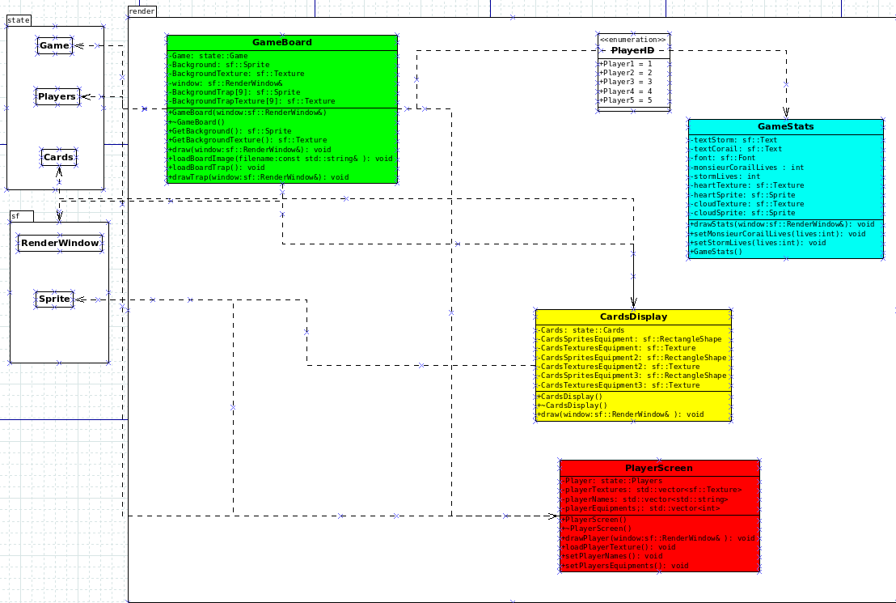

# Rapport de Projet Logiciel Transversal "CLUEDO CONSPIRATON"

[TESTU Tristan](https://github.com/TestuTristan), [CHAIEB Ilias](https://github.com/Ilias1313), [BOUZIANE Imade](https://github.com/ImadeBouziane)

# Sommaire

## [1. Présentation Générale](#1)

### [1.1 Archétype](#1.1)
### [1.2 Règles du jeu](#1.2)
### [1.3 Ressources](#1.3)

## [2. Description et conception des états](#2)

### [2.1 Description des états](#2.1)

#### [2.1.1 Élément Places](#2.1.1)
#### [2.1.2 Élément Players](#2.1.2)
#### [2.1.3 Élément Cards](#2.1.3)
#### [2.1.4 Élément Passives](#2.1.4)
#### [2.1.5 Élément Conspiracy](#2.1.5)

### [2.2 Conception logiciel : extension pour le rendu](#2.2)

## [3. Rendu: Stratégie et Conception](#3)

### [3.1 Stratégie de rendu d'un état](#3.1)
### [3.2 Conception logiciel](#3.2)

## [4. Règles de changement d'états et moteur de jeu](#4)

### [4.1 Changements extérieurs](#4.1)
### [4.2 Changements autonomes](#4.2)
### [4.3 Conception logiciel](#4.3)

## [5. Intelligence Artificielle](#5)

### [5.1 Stratégies](#5.1)
### [5.2 Conception logiciel](#5.2)

## [6. Modularisation](#6)

### [6.1 Organisation des modules](#6.1)
### [6.2 Conception logiciel](#6.2)

## 1. Présentation Générale 

### 1.1 Archétype 

L’objectif du projet est la réalisation du jeu « Cluedo : Conspiration» Il s’agit d’un jeu de rôle  qui mêle supercherie et déduction. C’est un jeu conçu pour 4 à 10 joueurs. Les joueurs incarnent des personnages du Cluedo classique et jouent des rôles secrets dans des équipes adverses. L’équipe des Amis cherchent à sauver M. Corail et à révéler le complot des conspirateurs. L’équipe des Conspirateurs tentent secrètement de saboter les plans des Amis et de mettre à exécution le complot de meurtre.

### 1.2 Règles du jeu 

Les joueurs ont été invités à l’Hôtel Resort la Vipère Noire dirigé par Carl Corail. Alors qu’une tempête se lève, les joueurs découvrent une série de pièges mortels dans l’hôtel. L’un des joueurs veut tuer Mr. Corail. Les joueurs doivent résoudre ce mystère sans savoir à qui faire confiance.
	
Une fois le jeu installé, chaque joueur choisit un personnage et se voit assigner un rôle secret. Les joueurs peuvent alors être un membre conspirateur qui veut tuer Mr. Corail ou un ami qui veut le maintenir en vie. Pendant la révélation du complot, tous les joueurs ferment les yeux sauf  les membres conspirateurs qui peuvent alors s’identifier secrètement les uns les autres et le conspirateur en chef montre les cartes lieux et armes à ses complices :  la conspiration est activé et la partie peut commencer. 

L’objectif principal des conspirateurs est d’exécuter le complot. Seul le conspirateur en chef peut tuer Mr. Corail si elle est la bonne personne , Garde du Corps de Mr . Corail , au bon endroit , lieu du complot , et au bon moment , après que Mr. Corail ait été blessé. Ils peuvent aussi tenter de tuer Mr. Corail en activant des pièges dans l’hôtel jusqu’à ce qu’il perde tous ses points de vie.

L’objectif principal des amis est de maintenir Mr. Corail en vie en désamorçant les pièges et en empêchant le complot. Mais même si Mr. Corail est tué par les pièges, les amis peuvent encore gagner en identifiant les éléments du complot : Qui est le conspirateur en chef ? Où voulait-il tuer Mr. Corail ? Et avec quelle arme ?

Le jeu se joue en rounds. A chaque round une équipe est choisie pour explorer un lieu pour désamorcer ou activer secrètement un piège. Le rôle de l'Éclaireur change à chaque round. Chaque tour, l’éclaireur choisi trois éléments : un Lieu où se rendre , un Garde du Corps ( il a la responsabilité d’escorter Mr. Corail vers le lieu et de récupérer les indices.) et les autres membres de l'équipe  qui l'accompagnent. Choisir ses accompagnants est important. Une fois le choix de l’éclaireur effectué, tous les joueurs votent pour savoir si l’équipe choisie doit se déplacer dans le lieu. La majorité l’emporte et en cas d’égalité le vote est rejeté. S’il est rejeté le traqueur de tempête avance de un (Si le traqueur de tempête vaut 3, Mr. Corail perd un Point de Vie) et le joueur de gauche devient le nouvel éclaireur. Si le vote est approuvé tous les joueurs choisi et Mr. Corail se déplace vers le lieu choisi. Une fois dans le lieu, les joueurs demandent si le complot est activé.

Une fois sur le lieu, l’équipe choisie essaye de désamorcer le piège. Chaque lieu comprend trois cartes : 1 carte piège face visible et deux cartes Indices face cachée. Pour désamorcer les pièges ont doit utiliser les cartes équipement présent dans notre main. Toutes les cartes d'équipement valent 1 ou 2. Si la valeur est deux, la carte aura aussi une couleur : soit un triangle bleu ou un cercle rose. Les pièges ont également une valeur et une couleur. La valeur sur le piège est le seuil que l’équipe choisit doit atteindre si elle veut désamorcer le piège. Les cartes équipement de même couleur que le piège s'additionnent, le désamorce et les cartes de couleurs  contraires sont soustraites.  Les joueurs ne peuvent jamais avoir plus de trois cartes d’équipements en main. Chaque joueur sur le lieu doit soumettre au moins une carte équipée face cachée à l’Eclaireur. L’Eclaireur récupère et mélange les cartes reçues puis les retourne une à une pour additionner la valeur totale des équipements. Si elle est égale ou supérieur au nombre dans le coin bas gauche du piège  Mr. Corail est sauvé pour ce round. Mais si la valeur totale est inférieur à celle du piège, Mr. Corail est blessé et devient ainsi vulnérable à la conspiration. Dans les deux cas le piège est retiré et le Garde Du Corps  récupère les cartes indices présentés sous le piège (il peut mentir au sujet des indices). Il y a quatre types d’indices : Armes , Lieux, Aucun indice et Désamorçage Instantané (peut désamorcer un piège instantanément sans que les joueurs ait à poser des cartes équipements. Ensuite après avoir annoncé (ou menti) les cartes Indices , le Garde du Corps repose face cachée les indices devant lui et prend un jeton (si il a annoncé une Arme ou un Lieu) qu’il place devant lui comme repère pour savoir qui a vu quoi.
 
La dernière étape du Round est de distribuer les cartes Équipements. L’Eclaireur pioche le nombre de cartes Equipement équivalent au nombre de pions (dont celui de Mr. Corail) puis, sans les regarder , il les distribue comme il le veut aux joueurs sur ce Lieu. Les joueurs non présents piochent également une carte Équipement (à condition qu’ils aient moins de 3 cartes). Enfin, le joueur à la gauche de l’Eclaireur devient le nouvel Éclaireur pour le tour suivant et un nouveau round commence. 

Tous les rounds se déroulent de la même façon jusqu’à ce que la partie se termine d’une des trois façon suivantes :  
Les Amis se rendent dans tous les lieux et retirent tous les pièges avant que Mr. Corail ne soit tué. => Les Amis gagnent 
Le complot est activé et Mr. Corail est assassiné => La conspiration gagne 
Mr. Corail est tué par les pièges , le jeu passe alors à l’accusation finale. Pour les Amis ,c’est la dernière chance de découvrir la conspiration. Pour les conspirateurs c’est leur dernière chance d’échapper à la justice. Le nouvel Éclaireur choisit une équipe sans Garde du Corps ni Lieu et les joueurs passent au vote pour cette dernière. Si le vote n’est pas approuvé, on vote pour la prochaine équipe créée par l’Eclaireur suivant. Une fois le vote approuvé, l’ Eclaireur récupère toutes les cartes Indices restantes, les mélange et les distribue une à une aux joueurs choisis dans l’équipe. Les joueurs retournent ensuite sur le plateau et ils ont 5 minutes pour discuter et débattre de chaque élément du complot. Qui est le conspirateur en chef ? Où avait-il prévu de tuer Mr. Corail ? Quelle arme avait-il l’intention d’utiliser ? Une fois le temps écoulé, tous les joueurs votent et la majorité l’emporte. En cas d’égalité, l’Eclaireur tranche. Une fois l’accusation faite, le conspirateur en chef se dévoile et il dévoile le lieu et l’arme. Si tout était juste les Amis gagnent sinon c’est la conspiration qui gagne !

### 1.3 Ressources 

**Le plateau de jeu:**

**Role Secret:**

**Les cartes Joueurs/Identités:**

**Les cartes indices:**

**Les cartes équipements:**

**Les cartes pièges:**

# 2. Description et conception des états 

## 2.1 Description des états 

Notre état de jeu est notre état principal ,on y retrouve tous les éléments nécessaires au déroulement du jeu. Tout d'abord, on a le nombre de player avec la liste des players dans la partie. On a aussi besoin de savoir quel est le tour du joueur (Eclaireur). Ensuite on a des rôles publics et privés à distribuer. Il nous faut également un certain nombre de cartes, de lieux et d'armes. Un état est alors composé de différents éléments : 

### 2.1.1 Elément Places : 

Une place (un lieu) est un endroit du board où les joueurs pourront aller a chaque tour, ils seront caractérisé par une ID. Il y aura des pièges, des indices et enfin dans certains cas, les lieux pourront être sûrs ou piégés.

### 2.1.2 Elément Players : 

Un Player est caractérisé par son ID, chaque joueur aura un RoleType qui peut changer à chaque tour. Chaque joueur aura un RoleSecret attribué au début de la partie. Son rôle privé ne change tout du long de la partie . Chaque players peut avoir des cartes équipements. Il a le droit de vote. De plus, il pourra annoncer (ou pas) les indices trouvés.

 Dans les RoleType on retrouve :
- SIMPLE: Un rôle sans importance qui pourra voter pour un lieu
- SCOUT: Un rôle primaire qui change à chaque tour.
- BODYGUARD: Un rôle choisi par le SCOUT

### 2.1.3 Elément Cards : 

Chaque carte est caractérisée par une Id et un type. Il y a 3 types de cartes :
 
 -Equipements : Ces cartes auront une valeur et deux signes possible, triangle,cercle, les deux ou rien qui influencera l'utilisation de cette dernière.
 -Indices : Les cartes indices seront caractérisées par un type d'indice qui peuvent être : Rien, Désamorçage instantanées, un équipement ou un lieu (safe).
 -Pièges : Les cartes pièges seront posées sur les lieux et ils auront une valeur, et comme les cartes indices, un signe ou deux (Cercle, Triangle). De plus, elles pourront être désamorcées par les joueurs allant dans ces lieux.

### 2.1.4 Element Passives : 

L'état passif est l'ensemble des mécaniques du jeu automatique. C'est-à-dire c'est intrinsèque au jeu. Il y a les points de vie de Mr.Corail, l'activité de la tempête (int allant de 0 à 3 qui influencera les points de vie de Mr.Corail). Et enfin l'état de santé de Mr.Corail.

### 2.1.5 Element Conspiracy : 

Ce dernier caractérise un lieu, un joueur et une arme. Ce sont les  conditions d'activation du complot.

## 2.2 Conception logiciel : extension pour le rendu 

Le diagramme des classes pour les états est présenté ci-dessous, dont nous pouvons mettre en évidence les groupes de classes suivants :

Game : Cette classe (En Bleu) constitue notre création de notre jeu. Dans laquelle se trouve tous les éléments indispensables à la création du jeu.

Les éléments constituant le jeu : Que ce soit les passives, Conspiracy, Places, Weapons, players et cartes. tout ces éléments (En Jaune)  constitue le jeu et doivent être au même niveau hierarchique par rapport à game. Pour Players on aura une énumération RoleType afin de lui attribuer un TypeRole qui devrait changer à chaque tour.

Les cartes : Les cartes seront constituées en 3 types. Les Équipements, les Traps et les Clues. Chaque type de cartes héritera d'une idée et d'un type.

## 3. Rendu: Stratégie et Conception 

### 3.1 Stratégie de rendu d'un état 

Le but de notre affichage sera de représenter un état fixe de notre jeu. Ce dernier dépendra du stade de la partie auquel on se trouve qui sera lui-même définit à l'aide des codes présents dans le répertoire src/render/state. 

Nous ne nous aventurerons pas à vouloir faire marcher le jeu sous plusieurs résolutions et garderons celle d'origine. Pour la police de nos texte, nous en choisirrons une libre de droit: "04FONT".

Les cartes et le plateau seront conçu sous forme de rectangle.

### 3.2 Conception logiciel 

Nous disposerons de plusieus classes pour nous permettre de créer un affichage cohérent avec nos attentes : 

 -En vert, la classe "GameBoard" correspondant au plateau de jeu principal, commun à tous les joueurs. 
 
 -En cyan, la classe "GameStats" contiendra toutes les données non fixes concernant la partie dont l'intégralité des joueurs peuvent avoir accès.
   
 -En jaune, la classe "CardsDisplay" qui permet d'afficher les différentes cartes existant dans le jeu.
   
 -En rouge, "PlayerScreen" qui représente les éléments connus seulement par le joueur en lien avec la session.
    
 -Enfin en blanc, "PlayerID" qui concorde avec le joueur actuellement en possesion du rôle d'éclaireur, c'est à dire celui qui propose une composition d'équipe pour aborder un lieu.  
 

## 4. Règles de changement d'états et moteur de jeu 

Les changements d’état ne suivent pas d’horloge globale, chaque état sera mis à jour à l’issu d'exécutions de commandes par le joueur vers l’engine ou par l’engine vers le joueur.

### 4.1 Changements extérieurs 

à compléter

### 4.2 Changements autonomes 

à compléter

### 4.3 Conception logiciel 

## 5. Intelligence Artificielle 

### 5.1 Stratégies 

à compléter

### 5.2 Conception logiciel 

à compléter

## 6. Modularisation 

### 6.1 Organisation des modules 

à compléter

### 6.2 Conception logiciel 

à compléter
